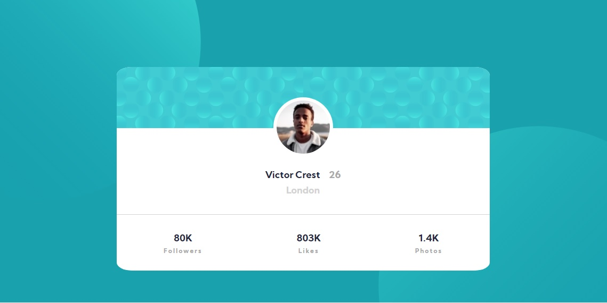

# Frontend Mentor - Profile card component solution

This is a solution to the [Profile card component challenge on Frontend Mentor](https://www.frontendmentor.io/challenges/profile-card-component-cfArpWshJ). Frontend Mentor challenges help you improve your coding skills by building realistic projects.

## Table of contents

- [Overview](#overview)
  - [The challenge](#the-challenge)
  - [Screenshot](#screenshot)
  - [Links](#links)
- [My process](#my-process)
  - [Built with](#built-with)
  - [What I learned](#what-i-learned)
  - [Continued development](#continued-development)
  - [Author](#author)

## Overview

im just practice some css and html for improve my skills

### The challenge

- Build out the project to the designs provided

### Screenshot

### Links

- Solution URL: [CardList Repo](https://github.com/OscarRavelo/CardStyle)
- Live Site URL: [CardList live Site](https://oscarravelo.github.io/CardStyle/)

## My process

start with the skeleton of the design thinking in mobile first, then i just insert the card skeleton in a section and set the size in the section. After more delete repeat process i get satisfied with my mobile version while i was testing for desktop option i just realize i only have to set a min-max width and heigh for make the design responsive, i realize after finish the project i can use grid for make make the card more smooth while i changing the screen size i will try it in next projects!.

### Built with

- Semantic HTML5 markup
- CSS custom properties
- Flexbox
- Mobile-first workflow

### What I learned

i learn about so many rules i forget i have to follow while i was doing this project, i made so many mistake with the card skeleton and sized of the card for made then responsive

### Continued development

for next project i will be use the rem em for sized and set margin and padding i didnt use it because i didnt wanted complicate the code for myself

## Author

- Oscar Ravelo
- Website - [Oscar Ravelo](https://github.com/OscarRavelo)
- Frontend Mentor - [@OscarRavelo](https://www.frontendmentor.io/profile/OscarRavelo)
- Twitter - [@Punkk1x](https://twitter.com/Punkk1x)

